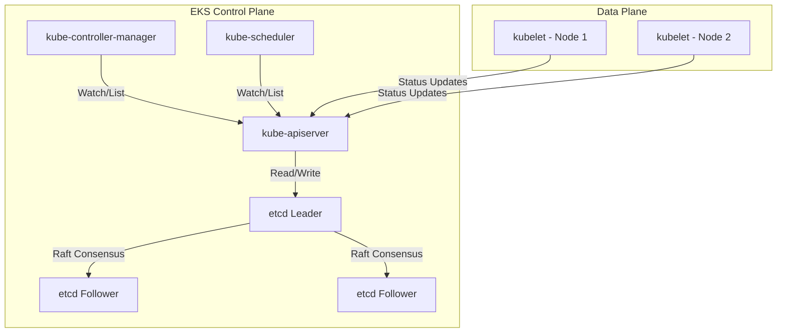
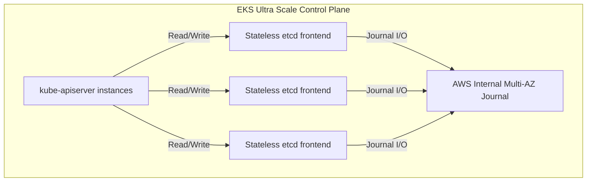

**By Shankar Ramanathan**

You can run Kubernetes for years without thinking about etcd. The control plane hums along, pods get scheduled, and deployments roll out. But when your cluster hits a certain scale, the abstraction leaks. Suddenly, API calls time out, controllers freeze, and your entire cluster goes read-only because a 1.5 MiB ConfigMap tipped a B+ tree over the edge.

Without visibility into the full request lifecycle, you're guessing. Traditional monitoring tracks application requests and latency. That works for stateless HTTP services.

The Kubernetes control plane is different. A single node degradation can trigger an infinite loop of scheduler retries, bloating the database until it refuses to take another write. It wasn't a config issue or a code bug. The cluster over period of time has grown too big for its database, until the problem presents itself.

Here is what actually happens when you push an Amazon EKS control plane to its limits, why the default dynamic scaling eventually breaks, and how we architect around it using Provisioned Control Planes and ultra-scale offloading for AI and ML workloads.

Glosarry:

- MVCC - Multi-Version Concurrency Control

## The default EKS architecture: MVCC, B+ trees, and the 8GB limit

In a standard EKS cluster, the control plane is fully managed. AWS provisions the API server instances, the controller manager, the scheduler, and a highly available etcd cluster spread across multiple Availability Zones.

When your workloads demand more, EKS detects the load and dynamically scales the API server replicas and the instance sizes backing them. This dynamic scaling works perfectly for 95% of use cases.

But there is a hard boundary hidden in the architecture: etcd itself.

In Kubernetes, only the API server communicates directly with etcd. The scheduler, the controller manager, `kubelet`, `kubectl`, and your custom operators all talk to the API server. etcd is the API server's private backend, and it stores all its data in a B+ tree key-value store backed by a single file on disk.



The upstream etcd project suggests a maximum database size of 8 GiB. EKS standard mode enforces this 8 GiB limit.

This sounds like plenty of space for text-based metadata. 8 gigabytes of pure text is enormous. But etcd doesn't just store the current state of your cluster. It uses MVCC.

### How MVCC amplifies storage

Every time an object is updated in Kubernetes, etcd does not overwrite the old data. Instead, it creates a full new revision of that object.

If you have a 512 KiB Pod specification and a controller patches its status 10 times in a minute, you haven't consumed 512 KiB of storage. You've consumed 5 MiB.

To understand why, let's look at how etcd tracks keys. When you query etcd for a key, it returns metadata along with the value:

```json
{
  "header": {
    "cluster_id": "123456789",
    "member_id": "987654321",
    "revision": 1500,
    "raft_term": 4
  },
  "kvs": [
    {
      "key": "L3JlZ2lzdHJ5L3BvZHMvc3lzdGVtL215LXBvZA==",
      "create_revision": 1400,
      "mod_revision": 1500,
      "version": 100,
      "value": "..."
    }
  ]
}
```

The `mod_revision` increments every time the object changes. Because etcd retains older revisions to support `WATCH` operations (allowing clients to catch up on missed events), the database size grows rapidly with every mutation.

## What breaks at scale: The silent creep of metadata

When you operate a high-churn cluster, the MVCC revisions pile up. The API server triggers a compaction operation every 5 minutes to clear out old, unneeded revisions. But compaction only marks the space as free; it doesn't return it to the operating system. To physically shrink the file, etcd must run a defragmentation process.

If your mutation rate outpaces compaction and defragmentation, you hit the wall. Here is what can actually breaks.

### 1. The Quota Alarm (ETCD_DB_SIZE_EXCEEDED)

When the etcd database file hits the 8 GiB limit, etcd triggers a `no space` alarm. It stops accepting writes. Your cluster immediately becomes read-only.

- You cannot deploy new pods.
- You cannot scale up your workloads.
- The `kube-scheduler` cannot bind pods to nodes.
- You cannot even delete objects to free up space.

Why can't you delete? Because in MVCC, a deletion is actually a write operation (a tombstone revision). If you try to run `kubectl delete pod my-pod`, the API server will return an error:

```text
Error from server (Forbidden): pods "my-pod" is forbidden: mvcc: database space exceeded
```

AWS implemented an automated recovery workflow that detects this state, forces a compaction and defragmentation, and disarms the alarm. But if your application is stuck in an aggressive crash-loop, the database will fill up again almost instantly.

### 2. Defragmentation Blocking

Defragmentation is a blocking operation. It locks the database while it rewrites the B+ tree to contiguous storage.

As fragmentation builds up over time, it results in increased storage space consumption and increased I/O load due to non-contiguous blocks, which ultimately affects the responsiveness of the Kubernetes API server.

On average, it takes up to 10 seconds to defragment one gigabyte of data. If your database is heavily fragmented and hovering near the 8 GiB limit, the defragmentation process can stall the API server for 30 to 60 seconds. During this window:
- `kubectl` commands hang.
- CI/CD pipelines time out.
- Controllers lose sync and drop their leader elections.

You will see logs like this in your controller manager:
```text
I0324 10:15:30.123456       1 leaderelection.go:278] failed to renew lease kube-system/kube-controller-manager: timed out waiting for the condition
```

### 3. API Server Memory Amplification

It's not just the disk that breaks. Large clusters with massive numbers of Custom Resource Definitions (CRDs) or large ConfigMaps put immense pressure on the API server's memory.

When a new controller starts up, it typically performs a `LIST` operation followed by a `WATCH`. If you have 50,000 Secrets in your cluster, a `LIST` operation requires the API server to fetch all 50,000 objects from etcd, deserialize them, serialize them into JSON or Protobuf, and stream them to the client.

A 500 MiB payload in etcd can easily consume 3 GiB of RAM in the API server during the serialization process. If multiple controllers start simultaneously (e.g., during a node rotation), the API server processes can/will OOM (Out Of Memory) crash.

### 4. Watch Event Throttling

When an object changes, the API server must notify every client that is watching that object. In a cluster with thousands of nodes, a change to a global resource like a DaemonSet triggers thousands of watch events simultaneously.

Kubernetes handles this via ResourceVersions (RV). The API server maintains an RV cache. If a client disconnects and reconnects, it requests events starting from its last known RV.

If the API server cannot push these events fast enough, or if the client is too slow to process them, the client falls behind. When the client's requested RV is no longer in the API server's cache, the API server drops the connection and returns a `Too old resource version` error.

```text
E0324 10:17:42.987654       1 reflector.go:312] k8s.io/client-go/informers/factory.go:134: Failed to watch *v1.Pod: failed to list *v1.Pod: resourceVersion too old
```

The client must then re-establish the connection and perform another expensive `LIST` operation, creating a thundering herd that brings the control plane to its knees.

### 5. Snapshot Pressure on Followers

etcd is a distributed system. The leader must replicate every transaction to the followers.

If a follower node restarts or drops offline for a few minutes, it will miss the latest Raft transactions. When it reconnects, the leader has to stream a multi-gigabyte snapshot to the follower to catch it up.

During that snapshot transfer, the leader's network bandwidth is saturated. It has less capacity for normal operations, causing write latencies to spike across the entire cluster.

## The breaking point: How to know you're hitting the ceiling

You should not wait for the EKS control plane to lock up before acting. The metrics are there, but you have to actively watch them.

### The critical metrics

If you deploy Prometheus to your cluster, scrape the EKS control plane metrics endpoint. The most critical metric is `apiserver_storage_size_bytes` (formerly `etcd_db_total_size_in_bytes` or `apiserver_storage_db_total_size_in_bytes` in older versions).

Run this PromQL query to track your database growth rate over time:

```promql
rate(apiserver_storage_size_bytes[1h])
```

If this value is consistently positive over a 24-hour period, your compaction rate is failing to keep up with your mutation rate.

You also need to track the total object counts. The API server exposes `apiserver_storage_object_counts`.

```promql
sum by (resource) (apiserver_storage_object_counts)
```

If you see a massive spike in a specific resource type (like `replicasets` or `endpoints`), you likely have a misconfigured controller.

### Checking the Raw Endpoint

You don't need a full Prometheus stack to check the current size. You can hit the raw metrics endpoint directly via `kubectl`:

```bash
kubectl get --raw /metrics | grep apiserver_storage_size_bytes
```

Output:
```text
apiserver_storage_size_bytes{endpoint="http://10.0.160.16:2379"} 7.210830848e+09
apiserver_storage_size_bytes{endpoint="http://10.0.32.16:2379"} 7.207840768e+09
apiserver_storage_size_bytes{endpoint="http://10.0.96.16:2379"} 7.208852480e+09

If that number approaches 8.0e+09 (8 GB), your cluster normal operation can be interrupted 🧨.

You can also run a check on total number of objects stored in ETCD which can also contribute towards the limit. The API server exposes metrics that lists the object count by resource type

```bash
kubectl get --raw=/metrics | grep apiserver_storage_objects |awk '$2>300' |sort -g -k 2
```
It is extremely important to watch the metric `apiserver_storage_objects` and setup alerting to avoid getting into an incident. Here is a configuration that you can use to integrate your alerts with your Alerting platf rm. Refer the [Alerting section](#1.-alert-on-excessive-growth)

>[!IMPORTANT]
<br>
> If your cluster breaches the ETCD storage space threshold 8GB then the cluster will get locked out and reach stalemate state with the CRUD operations.
<br>
>You won't be able to resolve the issue until AWS supports directly remove objects from ETCD storage which could take hours of back & forth with AWS support team and Approval chain

### Debugging with CloudWatch Insights

When you see a sharp spike in API server requests (`apiserver_request_total`), you need to know what is generating the load. The EKS audit logs hold the answer.

Enable Kubernetes Audit Logs in your EKS cluster settings, and run this CloudWatch Logs Insights query to find the top callers mutating your cluster state:

```text
fields @timestamp, @message
| filter @logStream like /^kube-apiserver-audit/
| parse @message '{"requestURI":"*","verb":"*","user":{"username":"*"},"userAgent":"*"}' as uri, verb, username, agent
| filter verb in ("create", "update", "patch")
| stats count(*) as RequestCount by username, agent, uri
| sort RequestCount desc
| limit 20
```

If you see `kube-scheduler` aggressively patching a specific Pod, you likely have an unschedulable pod spamming the control plane as the scheduler continually re-evaluates its constraints.

## Scaling past standard limits with Provisioned Control Plane

The EKS standard control plane dynamically scales the API server, but it cannot scale etcd beyond 8 GiB, and it cannot magically tune the Kubernetes controller manager to process Horizontal Pod Autoscaler (HPA) syncs faster without risking stability.

For specialized workloads—like multi-tenant SaaS platforms, large-scale batch processing, or massive HPA deployments—you cannot tolerate the latency of EKS detecting load and dynamically scaling the control plane. You need the capacity available before the spike hits.

This is why EKS introduced the Provisioned Control Plane.

Instead of waiting for EKS to scale your API servers, you pre-allocate capacity into specific scaling tiers: XL, 2XL, 4XL, and 8XL.

### Guaranteed Performance Limits

When you opt into a Provisioned Control Plane tier, EKS pins your cluster to a specific performance baseline.

| Provisioned Control Plane Tier | API request concurrency | Pod scheduling rate | Cluster database size | SLA |
|--------------------------------|-------------------------|---------------------|-----------------------|-----|
| XL                             | 2,000 seats             | 167 pods/sec        | 16 GB                 | 99.99% |
| 2XL                            | 4,000 seats             | 283 pods/sec        | 16 GB                 | 99.99% |
| 4XL                            | 8,000 seats             | 400 pods/sec        | 16 GB                 | 99.99% |
| 8XL                            | 16,000 seats            | 400 pods/sec        | 16 GB                 | 99.99% |

*Note: These values represent EKS v1.30 and later.*

By upgrading to an XL tier or higher, your etcd database limit immediately doubles from 8 GiB to 16 GiB. More importantly, your API request concurrency is guaranteed.

If you have a CI/CD pipeline that dumps 5,000 parallel requests to the API server during a release, a 4XL tier will absorb it without throttling, while a standard control plane would drop requests until it scaled up.

### The HPA Sync Concurrency advantage

There is a hidden bottleneck in upstream Kubernetes: the HPA controller.

By default, the `kube-controller-manager` processes HPA objects serially with a sync concurrency of 5. If you have 2,000 HPA objects in your cluster, it can take a significant amount of time for the controller to loop through all of them, fetch the metrics, calculate the desired replicas, and patch the Deployments.

In an EKS Provisioned Control Plane, AWS tunes the HPA sync concurrency much higher. This allows the controller manager to reconcile hundreds of HPA objects in parallel. The time between a change in load and the corresponding scaling action drops dramatically.

You can even adjust the `horizontalPodAutoscalerSyncPeriod` (which defaults to 15 seconds) down to 10 seconds.

AWS restricts this setting to Provisioned Control Planes because scanning metrics every 10 seconds for thousands of objects generates an enormous volume of API requests that would crush a standard control plane.

### How to apply the Provisioned Control Plane

You can upgrade an existing cluster via the AWS CLI. It does not require recreating the cluster.

```bash
# Upgrade to a 2XL tier via your IAC pipeline. This cli command is just for illustration
aws eks update-cluster-config \
  --name production-cluster \
  --control-plane-scaling-config tier=tier-2xl
```

You can view the current tier status:

```bash
aws eks describe-cluster --name production-cluster --query "cluster.controlPlaneScalingConfig"
```

```json
{
    "tier": "tier-2xl"
}
```

### The Trade-offs of Provisioned Mode

Predictability costs money. You pay an hourly rate on top of the standard EKS cluster fee.

| Control Plane Scaling Tier | Pricing |
|----------------------------|---------|
| XL                         | $1.65 per cluster per hour |
| 2XL                        | $3.40 per cluster per hour |
| 4XL                        | $6.90 per cluster per hour |
| 8XL                        | $13.90 per cluster per hour |

An 8XL control plane costs $13.90 per hour, which translates to roughly $10,000 per month just for the management plane.

There is also an **exit restriction**. If you scale up to a Provisioned tier, your etcd limit becomes 16 GiB. If your database grows to 12 GiB, you are trapped. You cannot **switch back** to the Standard control plane until you aggressively clean up your cluster, run compactions, and shrink the database back below the 8 GiB standard limit.

## Ultra scale: Offloading consensus for 100,000 nodes

Provisioned Control Planes solve the problem for 99% of enterprise workloads. But what if you are training a massive AI model requiring thousands of nodes, Trainium chips or NVIDIA GPUs to train and custom-designed machine learning accelerator microchips built by Amazon Web Services (AWS) to train and run multiple large artificial intelligence and generative AI models.

At that scale, etcd's Raft consensus algorithm becomes the bottleneck.

### The cost of consensus

etcd provides strong consistency, but the design choices that enable it also limit its scalability. In a standard etcd cluster, the leader must replicate every transaction to the followers over the network.

If the database is 16 GiB and a follower drops offline for a few minutes, it misses the latest Raft transactions. When it reconnects, the leader has to stream a multi-gigabyte snapshot to the follower to catch it up. During that snapshot transfer, the leader's network bandwidth is saturated, and write latency spikes.

For Amazon EKS Ultra Scale clusters, AWS fundamentally re-engineered the architecture. They completely offloaded the consensus backend.

### Journal offloading

Instead of etcd instances talking to each other via peer-to-peer Raft consensus, AWS modified etcd to write directly to a multi-AZ internal Journal system.



By removing Raft, the etcd nodes no longer maintain quorum among themselves. They act as stateless frontends to the Journal. This eliminates snapshot pressure, allows for partitioned key-spaces (splitting high-churn resources into separate storage paths), and pushes the write throughput up to 5x higher than standard etcd.

### Partitioned key-space

Kubernetes natively supports partitioning etcd clusters by resource type. While upstream etcd doesn't natively support key-space partitioning for simplicity, ultra scale clusters benefit significantly by splitting hot resource types (like Events or Pods) into separate etcd clusters.

With an optimal partitioning scheme, Amazon EKS achieved up to five times the write throughput while continuing to use etcd’s rich API semantics.

### Network Address Usage and Warm Prefixes

At 100,000 nodes, IP address management becomes a nightmare. Every pod getting a dedicated IP exhausts the VPC limits (256,000 Network Address Usage units).

By default, each pod gets an individual IP address from the cluster VPC. Given both an IP address and an IP prefix count as a single NAU unit regardless of the prefix size, AWS configured the Amazon VPC CNI with prefix mode for address management on ultra scale clusters.

Further, prefix assignment is done by Karpenter directly in the instance launch path with the Amazon VPC CNI discovering network metadata locally from the node after launch. These improvements streamlined the network with a single VPC for 100K nodes, while speeding up the node launch rate up to three-fold.

```bash
# Example command for rovisioned Control Plane. For Illustration Only. Use your IAC pipeline to drive the changes
aws eks update-cluster-config \
  --name batch-cluster \
  --control-plane-scaling-config tier=tier-4xl \
  --kubernetes-network-config serviceIpv4Cidr=10.100.0.0/16
```

*(Note: Parameter configuration is done through AWS APIs/Console under advanced cluster settings)*

## Concrete next steps to protect your control plane

Whether you are running 50 nodes or 5,000, you cannot ignore control plane hygiene. Hardware limits will catch you eventually. Here is how to implement safeguards today.

### 1. Alert on excessive growth

Deploy Prometheus and configure the `etcdExcessiveDatabaseGrowth` alert rule. Do not wait for the EKS dashboard to turn red. Test your alerts & change the alerting configuration as required.

If this alert triggers, check the `apiserver_storage_object_counts` metric to identify which resource type is causing the bloat.
```yaml
groups:
  - name: kubernetes-apiserver-etcd-storage
    rules:
      # 1. CRITICAL: Etcd approaching the 8GB hard quota limit
      - alert: KubeEtcdDatabaseQuotaApproachingLimit
        expr: (etcd_mvcc_db_total_size_in_bytes / 8589934592) * 100 > 85
        for: 5m
        labels:
          severity: critical
          tier: control-plane
          priority: P1
        annotations:
          summary: "CRITICAL: etcd database is over 85% of its 8GB quota"
          description: "The physical etcd database size is currently at {{ printf \"%.2f\" $value }}% of the 8GB limit. Immediate defragmentation or object deletion is required before the API server turns read-only."

      # 2. CRITICAL: Explosive object growth spiking etcd revision sizes
      - alert: KubeApiServerStorageObjectsSpike
        expr: (sum by (resource) (apiserver_storage_objects or apiserver_resource_objects) - sum by (resource) (apiserver_storage_objects offset 15m or apiserver_resource_objects offset 15m)) > 5000
        for: 5m
        labels:
          severity: critical
          tier: control-plane
          priority: P1
        annotations:
          summary: "Explosive object growth: {{ $labels.resource }}"
          description: "The number of '{{ $labels.resource }}' has surged by >5,000 in 15 minutes. This will rapidly exhaust the 8GB etcd database limit."

      # 3. WARNING: High overall count risking gradual bloat
      - alert: KubeApiServerStorageObjectsHighVolume
        expr: sum by (resource) (apiserver_storage_objects or apiserver_resource_objects) > 25000
        for: 30m
        labels:
          severity: warning
          tier: control-plane
          priority: P3
        annotations:
          summary: "High volume of objects: {{ $labels.resource }}"
          description: "Total count of '{{ $labels.resource }}' is {{ $value }}. This consumes massive etcd memory footprints under the 8GB limit."
```
You also need to ensure that the alert maps to the correct responder/teams
```yaml
route:
  group_by: [cluster, region]
  group_wait: 30s
  group_interval: 5m
  repeat_interval: 1h
  receiver: 'opsgenie'

receivers:
- name: 'opsgenie-control-plane'
  opsgenie_configs:
  - api_key: 'YOUR-OPSGENIE-INTEGRATION-API-KEY'
    api_url: 'https://opsgenie.com' # Use https://opsgenie.com if your account is in the EU region
    teams: ['Kubernetes-Platform-Team']
    tags: 'kubernetes,etcd,apiserver'
    # Map Prometheus labels dynamically to Opsgenie priorities
    priority: '{{ if eq .CommonLabels.priority "P1" }}P1{{ else if eq .CommonLabels.priority "P3" }}P3{{ else }}P4{{ end }}'
```

### 2. Cap your kubernetes object histories

For Example: Kubernetes keeps the last 10 ReplicaSets for every Deployment to support rollbacks. If you deploy 50 times a day, you have hundreds of orphaned ReplicaSets consuming etcd space.

Set `revisionHistoryLimit` in your Deployment manifests. Ideally, value of 2 or 3 is almost always sufficient but you may want to review on a object-by-object basis before making change and align with organization requirements.

### 3. Stop using etcd as an object store

Pod specifications with massive amounts of embedded metadata, or ConfigMaps containing megabytes of raw JSON configuration, destroy etcd performance.

Kubernetes limits individual values in etcd to **1.5 MiB**. If your ConfigMap exceeds 500 KiB, you are using the wrong tool.

Move that configuration to AWS Systems Manager Parameter Store, AWS Secrets Manager, or an S3 bucket, and have your application fetch it at startup. If you must use ConfigMaps, split them into smaller, logically separated objects.

### 4. Audit with Popeye

Run periodic/automated scans using tools like Popeye to find orphaned resources. An orphaned `RoleBinding` or a stale `Secret` from a deleted namespace might seem harmless, but at scale, these fragmented objects increase the API server's memory footprint during list operations.

Regularly auditing your cluster to identify and remove unused or orphaned objects reduces the storage footprint in etcd and minimizes the fragmentation impact.

### 5. Plan for Provisioned Control Planes

If your application traffic is highly seasonal (like a Black Friday retail event), run a load test against your staging cluster using a tool like `clusterloader2`.

Observe your API concurrency and pod scheduling rates. If you exceed the limits of a standard control plane, update your cluster configuration to an EKS Provisioned Control Plane (XL or 2XL) a week before the event.

Once the traffic subsides, ensure your database size is under 8 GiB, and scale back down to the standard EKS control plane configuration. This allows you to optimize costs while maintaining the performance your application requires during typical operational periods.

Without visibility into the full request lifecycle, you're guessing. Metrics show what's broken, but understanding the underlying architecture is where you'll actually figure out why. You can't fix a B+ tree quota alarm with more application instances. You fix it by respecting the metadata limits, tuning your controllers, and knowing exactly when to pay for guaranteed capacity.

## Deep Dive: A Real-World Failure Scenario

To truly understand how these limits interact in production, let’s walk through a hypothetical post-mortem of an etcd failure caused by a runaway controller. This scenario mirrors what happens when automated systems fail at scale.

### 02:00 UTC - The Initial Degradation
A third-party security daemon deployed as a `DaemonSet` on all 5,000 nodes receives a flawed rule update. The daemon begins crash-looping.

Every time a pod crashes, the `kubelet` on that node restarts it. Each restart updates the Pod's status field in the API server.
With 5,000 nodes, the API server is suddenly processing 5,000 status patches every few seconds.

### 02:05 UTC - MVCC Bloat
The mutation rate skyrockets to over 2,000 operations per second.
The `apiserver_storage_size_bytes` metric begins climbing rapidly.
Because etcd retains a full revision of each Pod object for every patch, the 8 GiB database limit is approaching fast. Compaction is running every 5 minutes, but the mutation rate is too high.

### 02:15 UTC - The Quota Alarm
The database hits the 8 GiB hard limit. etcd triggers the `ETCD_DB_SIZE_EXCEEDED` alarm.
The cluster goes read-only.
The API server returns `mvcc: database space exceeded` for all write requests.
At this point, HPA cannot scale deployments up to handle the morning traffic spike.

### 02:20 UTC - The Thundering Herd
Because the API server is dropping write requests, various controllers lose their leader election leases.
When they attempt to re-elect and sync state, they issue massive `LIST` commands.
The API server attempts to fetch 100,000 objects from the bloated etcd database into memory.
The API server instances OOM-kill and restart.

### 02:30 UTC - Recovery Attempts
Engineers log in and attempt to delete the offending `DaemonSet`.
```bash
kubectl delete daemonset security-agent -n kube-system
```
The command fails because deletion is a write operation (a tombstone), and the database is full.

### 02:40 UTC - Resolution
The AWS EKS automated recovery workflow detects the `no space` alarm.
It forces a defragmentation of the etcd database, locking it for 45 seconds.
The defragmentation clears enough space for writes to succeed again.
Engineers immediately patch the `DaemonSet` to stop the crash loop and delete the pods.

This timeline illustrates why monitoring database growth is critical. By the time the quota alarm fires, your mitigation options are severely limited.

## Advanced Configurations for Karpenter at Ultra Scale

When scaling to thousands of nodes, you cannot rely on standard Cluster Autoscaler (CA) behavior. EKS Ultra Scale clusters depend heavily on Karpenter, an open-source, high-performance node lifecycle management project.

Karpenter bypasses the concept of NodeGroups entirely. Instead, it observes unschedulable pods, calculates the aggregate resource requirements, and makes direct API calls to Amazon EC2 to launch right-sized instances.

### Static NodePools for Guaranteed Capacity

Machine learning training jobs are often batched in specific patterns. Karpenter’s reactive provisioning model doesn't anticipate this, which can cause provisioning delays when a massive job arrives simultaneously.

To address this, AWS introduced support for static capacity via NodePools. By using static NodePools(provisioned capacity), you can consistently create and maintain a minimum set of nodes in the cluster, thereby guaranteeing capacity for long-running AI/ML workloads.

```yaml
apiVersion: karpenter.sh/v1
kind: NodePool
metadata:
  name: ml-training-pool
spec:
  template:
    spec:
      requirements:
        - key: node.kubernetes.io/instance-type
          operator: In
          values: ["trn1.32xlarge", "p4d.24xlarge"]
        - key: topology.kubernetes.io/zone
          operator: In
          values: ["us-east-1a"]
  limits:
    cpu: "10000"
  weight: 100
```

### Prefix Mode for VPC CNI

To circumvent the 256,000 Network Address Usage (NAU) limit in an AWS VPC, you must configure the AWS VPC CNI to use prefix delegation.

Instead of assigning individual /32 IP addresses to each pod, the CNI assigns a full /28 prefix to the elastic network interface (ENI). This means one ENI can support up to 16 pods while only consuming a single NAU unit in the VPC.

```bash
kubectl set env daemonset aws-node -n kube-system ENABLE_PREFIX_DELEGATION=true
```

Additionally, Karpenter assigns these prefixes directly in the instance launch path. The VPC CNI discovers the network metadata locally from the node after launch, eliminating sequential API calls to the AWS EC2 endpoint and speeding up the node launch rate by 3x.

## Deep Dive: HPA Sync Concurrency in Provisioned Mode

One of the most critical, yet least understood, benefits of the Provisioned Control Plane is the tuning of the Horizontal Pod Autoscaler (HPA) controller.

### The Upstream Limitation

In the upstream Kubernetes codebase, the `kube-controller-manager` runs the HPA controller. This controller is responsible for querying the metrics API, computing the desired replicas for each Deployment, and issuing a patch operation.

```go
// From upstream kubernetes/pkg/controller/podautoscaler/horizontal.go
func (a *HorizontalController) Run(ctx context.Context, workers int) {
    defer utilruntime.HandleCrash()
    defer a.queue.ShutDown()

    klog.Infof("Starting HPA controller")
    defer klog.Infof("Shutting down HPA controller")

    for i := 0; i < workers; i++ {
        go wait.UntilWithContext(ctx, a.worker, time.Second)
    }

    <-ctx.Done()
}
```

By default, the number of `workers` (the sync concurrency) is set to 5.

If you have 1,000 HPA objects in your cluster, 5 workers must process 200 objects each. If each reconciliation takes 100 milliseconds (including the metrics fetch and API patch), it takes 20 seconds just to complete one full pass over all HPAs.

If a traffic spike hits at second 1, the HPA controller might not process the corresponding Deployment until second 20.

### The Provisioned Control Plane Advantage

In standard EKS mode, AWS cannot arbitrarily increase this concurrency because doing so would flood the etcd backend with write requests, potentially triggering the quota alarms discussed earlier.

However, in a Provisioned Control Plane (e.g., Tier 2XL or 4XL), AWS knows the control plane has a guaranteed API request concurrency of 4,000 to 8,000 seats.

Because the backend can handle the load, AWS tunes the HPA workers significantly higher. This allows the controller to reconcile hundreds of HPAs in parallel.

Furthermore, you can safely drop the `horizontalPodAutoscalerSyncPeriod` parameter from 15 seconds down to 10 seconds.

```yaml
# A typical HPA configuration that benefits from high concurrency for illustration
apiVersion: autoscaling/v2
kind: HorizontalPodAutoscaler
metadata:
  name: api-gateway-hpa
spec:
  scaleTargetRef:
    apiVersion: apps/v1
    kind: Deployment
    name: api-gateway
  minReplicas: 100
  maxReplicas: 1000
  metrics:
  - type: Resource
    resource:
      name: cpu
      target:
        type: Utilization
        averageUtilization: 60
```

This ensures that when a massive, unpredictable traffic burst arrives, your HPA controller calculates the new replica count and issues the patches in milliseconds rather than tens of seconds.

## Appendix A: Advanced API Server Configuration Parameters

When you upgrade to a Provisioned Control Plane, you don't just get more etcd space and HPA concurrency; you also unlock the ability to tune advanced Kubernetes control plane parameters that are restricted in standard mode.

AWS restricts these parameters in standard mode because they can materially increase control plane resource consumption, potentially destabilizing a dynamically scaled environment.

### Modifying Event TTL

Kubernetes `Event` objects are incredibly noisy. Every time a pod is scheduled, pulled, created, or restarted, an event is logged. By default, the API server retains events for 60 minutes (`eventTtl: 60m`).

In a massive cluster with 10,000 nodes, the volume of events generated in a single hour can easily consume gigabytes of etcd storage. While events are usually partitioned into a separate etcd cluster in EKS, they still consume API server memory and I/O.

If you are running a high-churn batch processing workload, you can reduce the `eventTtl` to alleviate pressure on the control plane. EKS provides additional parameters to modify kubernetes control plane behavior mentioned in the references section.

### Scheduler Scoring Strategies

By default, the `kube-scheduler` uses the `LeastAllocated` scoring strategy for `nodeResourcesFit`. This strategy favors spreading pods evenly across all available nodes by scoring nodes higher if they have more available CPU and memory.

However, for ultra-scale AI/ML workloads running on large EC2 instances (like `p4d.24xlarge`), spreading pods can result in fragmentation. You might end up with dozens of nodes that are 80% utilized, leaving no single node with enough capacity to schedule a massive distributed training pod that requires 8 GPUs.

In these scenarios, you can switch the scheduler to the `MostAllocated` strategy if that is exactly what your workload needs. This packs pods tightly onto nodes, filling one node completely before moving to the next. This reduces fragmentation and allows Karpenter to consolidate and terminate empty nodes faster, saving significant costs.

## Appendix B: The Anatomy of an etcd Snapshot Transfer

We mentioned earlier that Raft consensus breaks down at scale due to snapshot pressure. To fully appreciate why EKS Ultra Scale clusters offload consensus to the AWS Journal, we need to examine what happens during a snapshot transfer.

### The Raft Log and Compaction

Raft maintains a replicated log of all transactions. For example:
- Index 100: Create Pod A
- Index 101: Update Pod A status
- Index 102: Delete Pod B

Over time, this log grows infinitely. To prevent the log from consuming all available disk space, etcd periodically compacts the log, taking a snapshot of the current state machine and discarding the log entries before that snapshot.

### The Follower Failure

Assume the etcd leader has compacted its log up to Index 500,000.
A follower node experiences a temporary network partition and misses transactions from Index 490,000 to 510,000.

When the network partition heals, the follower reconnects and asks the leader for the missing entries starting from 490,000.
The leader checks its log and realizes it has already compacted everything before 500,000. It no longer has the individual entries the follower needs.

### The Snapshot Fallback

Because the leader cannot send the individual log entries, it has no choice but to send the entire database snapshot to the follower.

1. The leader pauses normal operations to serialize a 16 GiB snapshot of the database.
2. The leader streams the 16 GiB file over the network to the follower.
3. The follower receives the snapshot, drops its current database, and loads the 16 GiB file into memory.
4. The follower applies the snapshot and resumes participating in quorum.

### The Impact on the Cluster

During this transfer, the leader is pushing GiB's of data over its network interface. If the leader's network bandwidth is saturated, it cannot promptly replicate new incoming writes from the API server to the other followers.

This causes a latency spike across the entire Kubernetes cluster. API server requests queue up, controllers time out, and `kubectl` commands hang.

By offloading consensus to the AWS Journal in Ultra Scale clusters, EKS completely sidesteps this failure mode. The stateless etcd frontends do not maintain their own Raft logs, and they never need to send gigabyte-sized snapshots to each other. They simply read and write to the highly durable, multi-AZ Journal, maintaining sub-millisecond latencies regardless of the cluster size.

## Final Troubleshooting Matrix

If you are experiencing control plane latency, use this quick reference guide to identify the root cause.

| Symptom | Primary Metric to Check | Likely Cause | Resolution |
|---------|-------------------------|--------------|------------|
| `kubectl` completely unresponsive, returning `mvcc: database space exceeded` | `apiserver_storage_size_bytes` | etcd has hit the 8 GiB hard limit and gone read-only. | Wait for EKS auto-recovery to defragment, then aggressively delete orphaned resources. Consider Provisioned Control Plane. |
| Periodic 30-60 second lockups where all API requests hang | `etcd_disk_wal_fsync_duration_seconds` | etcd is performing a blocking defragmentation operation. | Reduce object mutation rate (e.g., fix crash-looping pods). |
| API server pods continually restarting (OOM killed) | API server memory usage, `apiserver_request_total` with `LIST` verbs | Controllers fetching massive numbers of large CRDs or Secrets. | Implement pagination in custom controllers. Clean up unused ConfigMaps. |
| HPA taking > 30 seconds to scale pods during a CPU spike | `workqueue_depth` in `kube-controller-manager` | Serial processing of HPA objects is bottlenecking. | Upgrade to a Provisioned Control Plane to unlock higher HPA sync concurrency. |
| Slow node provisioning during massive batch job submission | Node launch latency metrics | Cluster Autoscaler struggling with API rate limits or sequential NAU allocation. | Migrate to Karpenter, enable VPC CNI Prefix Delegation, and use static NodePools. |

By treating your control plane as a critical infrastructure component with physical limits, rather than an infinite magic abstraction, you can design systems that scale to millions of users without breaking a sweat.

## Frequently Asked Questions

**What happens if I exceed the 8GB etcd limit in a standard EKS cluster?**

When you hit the 8GB limit, etcd triggers a `no space` alarm. Your cluster immediately becomes read-only. You cannot deploy new pods, scale deployments, or even use `kubectl delete` because deletions are logged as new revisions (tombstones) in etcd's MVCC architecture. AWS provides an auto-recovery mechanism that forces a defragmentation, but if your mutation rate is high, you will quickly hit the limit again.

**Can I switch back to standard mode after using a Provisioned Control Plane?**

Yes, but with one critical restriction. Standard control plane mode supports up to 8 GB of cluster database size. If your cluster’s database size exceeds 8 GB while using a Provisioned mode (which supports up to 16 GB), you cannot switch back to standard mode until you clean up your cluster and reduce the database size below the 8 GB threshold.

**Why does my Kubernetes API server memory spike during controller restarts?**

When custom controllers or operators restart, they typically perform a `LIST` operation against the Kubernetes API to rebuild their local cache. If your cluster contains a massive number of large objects (like 50,000 Secrets or large ConfigMaps), the API server must fetch, deserialize, serialize, and stream these objects. This serialization process causes massive memory amplification, often leading to OOM-kill events on the API server.

**How does Karpenter assign IPs faster in EKS Ultra Scale clusters?**

In standard EKS, each pod receives an individual IP address, requiring frequent API calls to the AWS VPC endpoint, which can lead to throttling at scale. EKS Ultra Scale clusters leverage Karpenter to assign entire /28 IP prefixes directly during the EC2 instance launch path. The VPC CNI discovers this network metadata locally, eliminating sequential API calls and speeding up node launch rates by up to 3x.

**How can I load test my EKS control plane before a major event?**

You can use `clusterloader2`, the open-source Kubernetes scalability testing tool maintained by the Kubernetes community. It allows you to define complex load profiles in YAML and execute them against your cluster.

To simulate a massive traffic spike:
1. Provision a dedicated test cluster mirroring your production environment.
2. Define a `clusterloader2` configuration that creates thousands of Deployments, triggers HPA scaling events, and aggressively patches Pod statuses.
3. Observe the API server `apiserver_request_duration_seconds` and etcd `apiserver_storage_size_bytes` metrics during the test.
4. If latencies spike unacceptably or etcd hits the quota alarm, you have definitive proof that you need to upgrade to an EKS Provisioned Control Plane for your peak traffic window.

By understanding how etcd manages state, how the API server handles requests, and when to leverage AWS's advanced scaling options, you can run Kubernetes at any scale with absolute confidence.

**What is the difference between etcd compaction and defragmentation?**

Compaction is a lightweight process that runs automatically (typically every 5 minutes). It identifies old, unneeded MVCC revisions of objects and marks their space as available for future writes. However, it does not physically shrink the database file. Defragmentation is an expensive, blocking operation that rewrites the B+ tree to contiguous storage, releasing the unused space back to the underlying file system. Defragmentation locks the database, causing temporary API server unresponsiveness, which is why it is not run continuously.

**Noticing severe delays during pod launch on a new node. What could be the probable cause**

Implement **SOCI Fast Pull**: To avoid severe bottlenecks when pulling massive container images (5GB+), use Seekable OCI (SOCI) alongside high-provisioned EBS volumes to enable parallel unpacking and concurrent layer downloads.

**What Kubernetes(EKS) version would be ideal to start deploying for high scale containerized workloads?**

You must use at least Kubernetes **version 1.33** (specifically version 1.33.3 or higher). This version introduces the streaming list response feature to prevent API memory collapse, fixes paginated read fallbacks to ensure cluster stability, and features Consistent Reads from Cache (introduced in v1.31) to reduce server CPU usage by 30%.

## Reference Links

- [EKS Control Plane Configration](https://docs.aws.amazon.com/eks/latest/userguide/control-plane-configuration.html)
- [Scalability Best Practice](https://docs.aws.amazon.com/eks/latest/best-practices/scalability.html)
- [EKS ultra scale clusters](https://aws.amazon.com/blogs/containers/under-the-hood-amazon-eks-ultra-scale-clusters/)
- [Seekable OCI](https://aws.amazon.com/blogs/containers/introducing-seekable-oci-parallel-pull-mode-for-amazon-eks/)